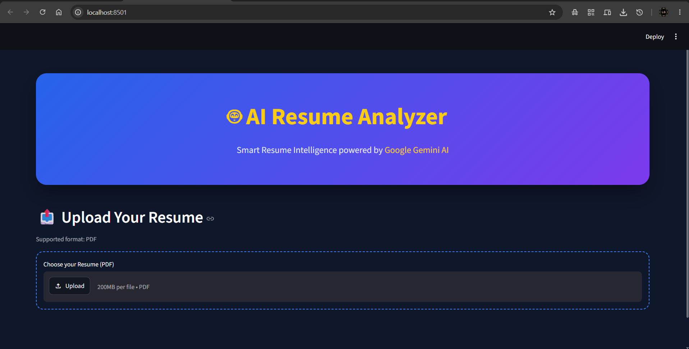

# 🤖 AI Resume Analyzer
## 📸 Application Preview


An AI-powered Resume Analyzer built using **Python**, **Streamlit**, **Google Gemini AI**, and **PyPDF2**.

The application analyzes a user's resume and provides:
- 📊 ATS Score
- 📝 AI Resume Summary
- 💪 Strengths
- ⚠️ Weaknesses
- 📌 Missing Skills
- 💡 Suggestions for Improvement
- 🎤 AI-generated Interview Questions

---

## 🚀 Features

- Upload Resume in PDF format
- Extract text from resume
- AI-powered resume analysis using Google Gemini
- Dynamic ATS Score
- Resume Summary
- Strengths & Weaknesses
- Missing Skills Detection
- Personalized Suggestions
- Interview Question Generator

---

## 🛠️ Tech Stack

- Python
- Streamlit
- Google Gemini API
- PyPDF2
- HTML & CSS

---

## 📂 Project Structure

```
AI-Resume-Analyzer/
│
├── app.py
├── requirements.txt
├── assets/
├── components/
├── utils/
└── README.md
```

---

## ⚙️ Installation

Clone the repository

```bash
git clone https://github.com/lakshyagupta16/AI-Resume-Analyzer.git
```

Go inside the project

```bash
cd AI-Resume-Analyzer
```

Install dependencies

```bash
pip install -r requirements.txt
```

Create a `.env` file

```
GEMINI_API_KEY=YOUR_API_KEY
```

Run the application

```bash
streamlit run app.py
```

---

## 📈 Future Improvements

- Better UI/UX
- Interactive Dashboard
- Resume PDF Report Download
- Multi-language Resume Support
- Resume Comparison
- Job Description Matching

---

## 👨‍💻 Author

**Lakshya Gupta**

B.Tech CSE Student | AI & ML Enthusiast
